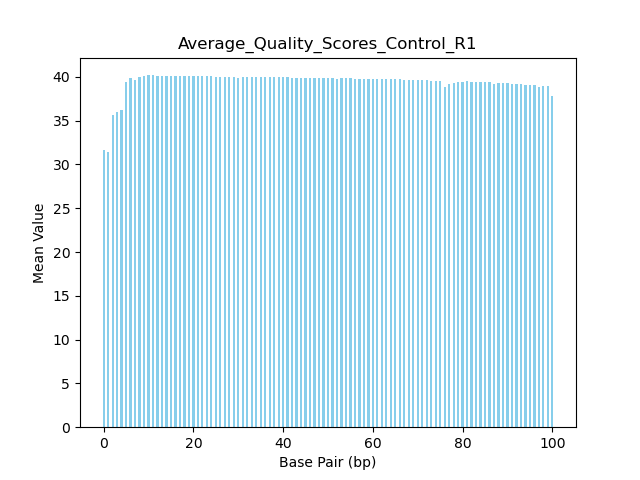
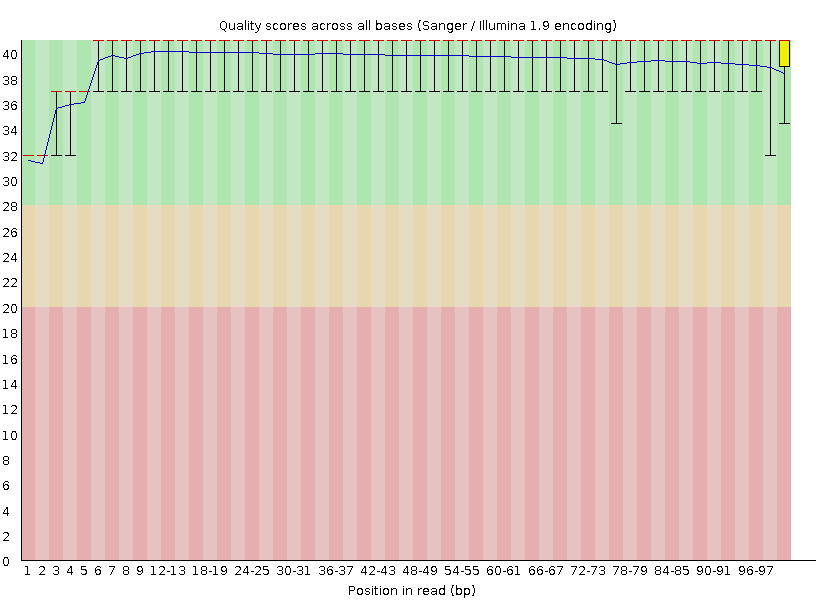
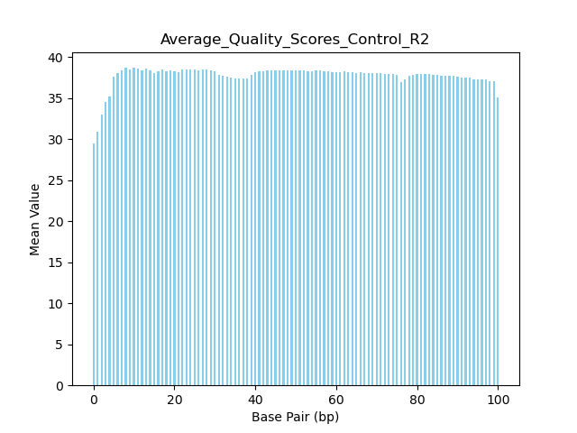
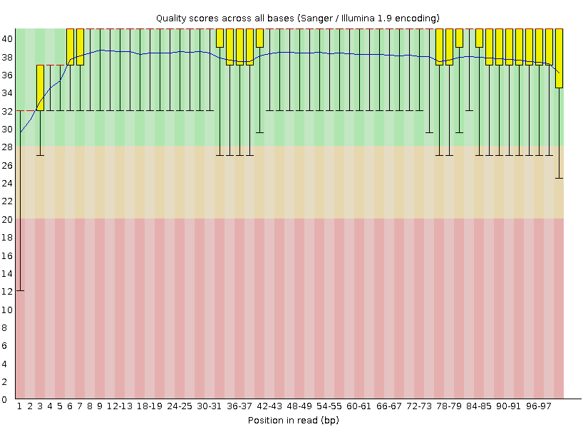
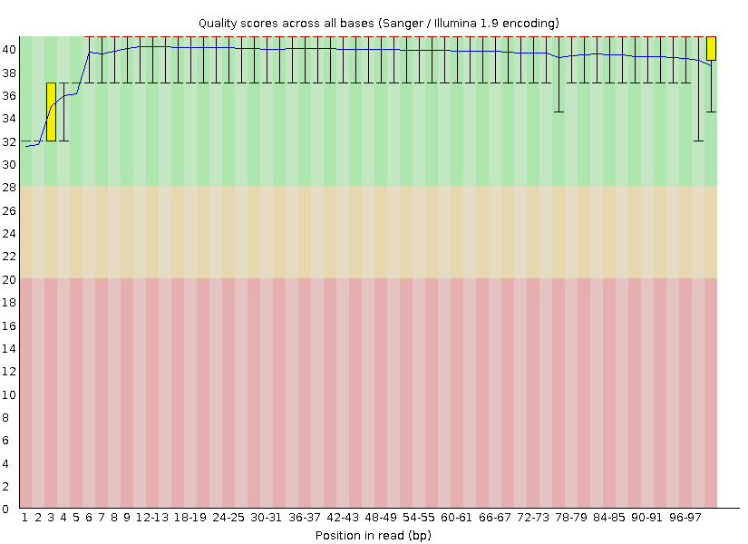
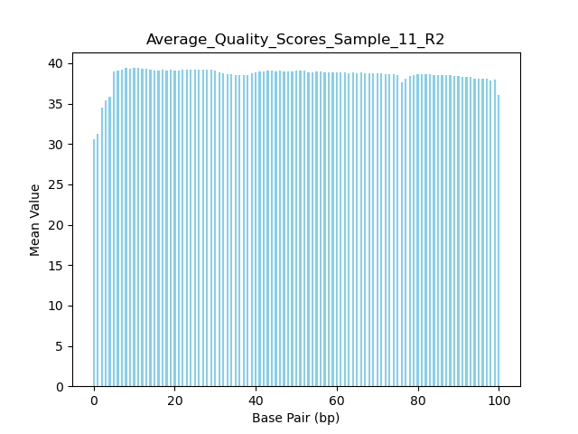
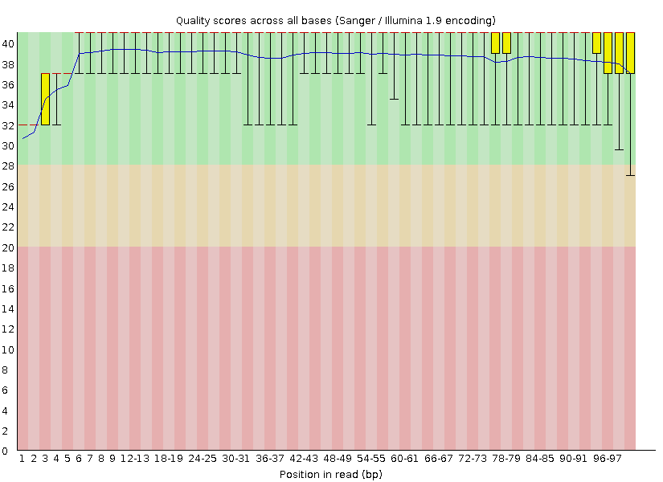

August 24th, 2024: Still Reeling from the Fact that I Exist 
---

Made a copy of Leslie's repo and put it in `/home/cwell/bgmp/bioinfo/Bi623/QAA`

`git clone https://github.com/claire-j-wells/QAA.git`

Made this beautiful lab notebook. File assignment: 

Claire 11_2H_both_S9_L008      14_3B_control_S10_L008

Path files:

***11_2H_both_S9_L008*** <br>

11_R1: `/projects/bgmp/shared/2017_sequencing/demultiplexed/11_2H_both_S9_L008_R1_001.fastq.gz`

11_R2: `/projects/bgmp/shared/2017_sequencing/demultiplexed/11_2H_both_S9_L008_R2_001.fastq.gz`

***14_3B_control_S10_L008***<br>

C_R1: `/projects/bgmp/shared/2017_sequencing/demultiplexed/14_3B_control_S10_L008_R1_001.fastq.gz`

C_R2: `/projects/bgmp/shared/2017_sequencing/demultiplexed/14_3B_control_S10_L008_R2_001.fastq.gz`

Created conda environment:

`conda create --name QAA`

`conda install --name QAA fastqc=0.12.1`

Verified by:
`conda activate QAA`

`conda list`

`fastqc --version`

updated python to 3.12:
`conda install --name QAA python=3.12`

Data exploration stuff

For length of files: 

`zcat /projects/bgmp/shared/2017_sequencing/demultiplexed/14_3B_control_S10_L008_R2_001.fastq.gz | wc -l`

| File name | `wc -l` | Num. Records | Phred encoding | File Size | Read Length
|---|---|---|---|---|---|
| 11_2H_both_S9_L008_R1_001.fastq.gz | 71676772 | 17919193 | phred+33 | 917M | 101
| 11_2H_both_S9_L008_R2_001.fastq.gz | 71676772 | 17919193 | phred+33 | 987M | 101
| 14_3B_control_S10_L008_R2_001.fastq.gz | 17761512  | 4440378 | phred+33 | 231M | 101
| 14_3B_control_S10_L008_R2_001.fastq.gz | 17761512 | 4440378 | phred+33 | 260M | 101

Checked Phred Encoding by heading first 3 records, one from each set: 

`zcat /projects/bgmp/shared/2017_sequencing/demultiplexed/11_2H_both_S9_L008_R1_001.fastq.gz | head -n 12`

`zcat /projects/bgmp/shared/2017_sequencing/demultiplexed/14_3B_control_S10_L008_R2_001.fastq.gz | head -n 12`

Phred +33 encoding due to pound signs and slashes 

Check file size: `ls -lah /projects/bgmp/shared/2017_sequencing/demultiplexed/`

How I figured out read length: file name adjusted, output reported in table above:

`zcat /projects/bgmp/shared/2017_sequencing/demultiplexed/11_2H_both_S9_L008_R2_001.fastq.gz | sed -n '2~4p' | awk '{print length($0)}'
| head -4`


***SBATCH Job Numbers*** <br> 

15875292 11_R1 <br>
``
    Command being timed: "fastqc -o FastQC_11_out/R2_11 -t 1 /projects/bgmp/shared/2017_sequencing/demultiplexed/11_2H_both_S9_L008_R2_001.fastq.gz"
	User time (seconds): 69.36
	System time (seconds): 3.29
	Percent of CPU this job got: 99%
	Elapsed (wall clock) time (h:mm:ss or m:ss): 1:12.93

```

15875291 11_R2:
```
    Command being timed: "fastqc -o FastQC_11_out/R1_11 -t 1 /projects/bgmp/shared/2017_sequencing/demultiplexed/11_2H_both_S9_L008_R1_001.fastq.gz"
	User time (seconds): 65.27
	System time (seconds): 3.06
	Percent of CPU this job got: 98%
	Elapsed (wall clock) time (h:mm:ss or m:ss): 1:09.71
```
15875308 R1_C:

```
    Command being timed: "fastqc -o FastQC_C_out/R1_C -t 1 /projects/bgmp/shared/2017_sequencing/demultiplexed/14_3B_control_S10_L008_R1_001.fastq.gz"
	User time (seconds): 19.62
	System time (seconds): 0.92
	Percent of CPU this job got: 107%
	Elapsed (wall clock) time (h:mm:ss or m:ss): 0:19.17
```


15875309 R2_C:


```
    Command being timed: "fastqc -o FastQC_C_out/R2_C -t 1 /projects/bgmp/shared/2017_sequencing/demultiplexed/14_3B_control_S10_L008_R2_001.fastq.gz"
	User time (seconds): 19.82
	System time (seconds): 1.08
	Percent of CPU this job got: 109%
	Elapsed (wall clock) time (h:mm:ss or m:ss): 0:19.16
    


Sorted images into `Lab_Notebook_png/FastQC` folder. Four sub directories: `R1_11 and R2_11` and `R1_C and R2_C` respectively. Will add organized images to lab notebook later. 


Need N-content and per base quality


Install Trimmomatic and CutAdapt


`conda install --name QAA cutadapt=4.9`

`conda install --name QAA trimmomatic=0.39`

Versions Verified to be correct. 

Part 1 Question 2: When looking at the plots, they are consistent with the quality score plots because in the n-content plots we see a small spike in N and in the per base quality, we see a match that quality is lower. 

Made 2 slurm scripts: `avg_qual_11.sh` and `avg_qual_C.sh` for running my own script `avg_qual.py` from demultiplexing assignment. 

Edit: Something janky was going on. Made a slurm script for each individual file to avoid confusing myself. 

***Control***
| Average Qual Score Script | FastQC | 
|---|---|
| |  |
| |  |

***Sample 11***
| Average Qual Score Script | FastQC | 
|---|---|
| |  |
| |  |

Part 1, Question 3: The FastQC plots in general are the same as my own plots. FINISH THIS.

This is cutadapt 4.9 with Python 3.12.5
Command line parameters: -a AGATCGGAAGAGCACACGTCTGAACTCCAGTCA -A AGATCGGAAGAGCGTCGTGTAGGGAAAGAGTGT -o trimmed.R1_Control.fastq.gz -p trimmed.R2_Control.fastq.gz /projects/bgmp/shared/2017_sequencing/demultiplexed/14_3B_control_S10_L008_R1_001.fastq.gz /projects/bgmp/shared/2017_sequencing/demultiplexed/14_3B_control_S10_L008_R2_001.fastq.gz
Processing paired-end reads on 1 core ...
Finished in 66.805 s (15.045 µs/read; 3.99 M reads/minute).

Control

```
=== Summary ===

Total read pairs processed:          4,440,378
  Read 1 with adapter:                 264,208 (6.0%)
  Read 2 with adapter:                 299,716 (6.7%)
Pairs written (passing filters):     4,440,378 (100.0%)

Total basepairs processed:   896,956,356 bp
  Read 1:   448,478,178 bp
  Read 2:   448,478,178 bp
Total written (filtered):    888,687,121 bp (99.1%)
  Read 1:   444,415,775 bp
  Read 2:   444,271,346 bp

```

Sample 11 Cutadapt Out
```
=== Summary ===

Total read pairs processed:         17,919,193
  Read 1 with adapter:                 874,706 (4.9%)
  Read 2 with adapter:               1,016,991 (5.7%)
Pairs written (passing filters):    17,919,193 (100.0%)

Total basepairs processed: 3,619,676,986 bp
  Read 1: 1,809,838,493 bp
  Read 2: 1,809,838,493 bp
Total written (filtered):  3,602,949,169 bp (99.5%)
  Read 1: 1,801,756,130 bp
  Read 2: 1,801,193,039 bp

```


Cut Adapt Command General as per Manual: 

```
cutadapt \
    -a AGATCGGAAGAGCACACGTCTGAACTCCAGTCA \
    -A AGATCGGAAGAGCGTCGTGTAGGGAAAGAGTGT \
    -o trimmed.R1.fastq.gz -p trimmed.R2.fastq.gz \
    reads.R1.fastq.gz reads.R2.fastq.gz

```


Sanity Check for Adaptor Sequences
```
zcat /projects/bgmp/shared/2017_sequencing/demultiplexed/14_3B_control_S10_L008_R1_001.fastq.gz | grep -c "AGATCGGAAGAGCACACGTCTGAA
CTCCAGTCA" 

output: 27403
```

```
zcat /projects/bgmp/shared/2017_sequencing/demultiplexed/14_3B_control_S10_L008_R2_001.fastq.gz | grep -c "AGATCGGAAGAGCGTCGTGTAGGGAAAGAGTGT"

output: 27686
```

```
zcat /projects/bgmp/shared/2017_sequencing/demultiplexed/11_2H_both_S9_L008_R1_001.fastq.gz | grep -c "AGATCGGAAGAGCACACGTCTGAACTCCAGTCA"

output: 23629
```
```
zcat /projects/bgmp/shared/2017_sequencing/demultiplexed/11_2H_both_S9_L008_R2_001.fastq.gz | grep -c "AGATCGGAAGAGCGTCGTGTAGGGAAAGAGTGT"

output: 24496
```

Use this command to highlight the adaptor sequences in the file: 

Adjust files accordingly. 

```
zcat /projects/bgmp/shared/2017_sequencing/demultiplexed/11_2H_both_S9_L008_R2_001.fastq.gz | grep "AGATCGGAAGAGCGTCGTGTAGGGAAAGAGTGT"| less -p AGATCGGAAGAGCGTCGTGTAGGGAAAGAGTGT  
```


We used grep for to check for these sequences and we wanted to get a rough estimate for how many of the adaptor there was so we used -c. We confirmed the adaptor sequences by finding the Illumina command on the cutadapt manual and then confirmed this by checking on the assignment page. 

Sanity check: We would expect the adaptor sequences to be on the end because Illumina reads from 5' to 3'.

Read this later!!! https://support.illumina.com/ko-kr/bulletins/2016/04/adapter-trimming-why-are-adapter-sequences-trimmed-from-only-the--ends-of-reads.html#:~:text=The%20adapters%20contain%20the%20sequencing,found%20on%20the%205'%20ends.


***cutadapt did NOT change the length of the file!!!***

August 25th, 2024: can't stop won't stop
-----

Doing some preliminary data analysis in order to figure out if trimmomatic is meant to be used on the original files or on the cutadapt outputs. 


```
zcat trimmed.R1_11.fastq.gz | sed -n '2~4p' | awk '{print length($0)}' | sort -nr | uniq -c 
```


Used the following command on `cutadapt` output files. Removed the `ILLUMINACLIP:TruSeq3-PE.fa:2:30:10` portion of the command because we do NOT want to remove adaptors since cutadapt already did that for us!!!! 

```
usr/bin/time -v trimmomatic PE /home/cwell/bgmp/bioinfo/Bi623/QAA/cut_adapt_out/trimmed.R1_11.fastq.gz /home/cwell/bgmp/bioinfo/Bi623/QAA/cut_adapt_out/trimmed.R2_11.fastq.gz output_forward_paired_R1_11.fq.gz output_forward_unpaired_R1_11.fq.gz output_reverse_paired_R2_11.fq.gz output_reverse_unpaired_R2_11.fq.gz LEADING:3 TRAILING:3 SLIDINGWINDOW:5:15 MINLEN:35
````

```
/usr/bin/time -v trimmomatic PE /home/cwell/bgmp/bioinfo/Bi623/QAA/cut_adapt_out/trimmed.R1_Control.fastq.gz /home/cwell/bgmp/bioinfo/Bi623/QAA/cut_adapt_out/trimmed.R2_Control.fastq.gz output_forward_paired_R1_Control.fq.gz output_forward_unpaired_R1_Control.fq.gz output_reverse_paired_R2_Control.fq.gz output_reverse_unpaired_R2_Control.fq.gz LEADING:3 TRAILING:3 SLIDINGWINDOW:5:15 MINLEN:35
```

Time output for Trimmomatic Run on Control. Exit Status 0. 

```
User time (seconds): 244.15
        System time (seconds): 4.32
        Percent of CPU this job got: 212%
        Elapsed (wall clock) time (h:mm:ss or m:ss): 1:56.93
```

Sunday September 1st: It's Sunday night...10pm and I'm doing this by CHOICE
-----

-Reran trimmed_dist.py so to include titles and bins. Bin number was set to 100 the first go around but then I remembered that Leslie mentioned something about having a bin for each nucleotide length and given that there should be 101-35 = 66, I set the number to be 66 bins instead. I compared the two graphs and I think that the 66 bins graph allows for a little bit more readability compared to having 100 bins. Did not run sbatch but runs were quick. 

#
Star Conda install commands:

```
conda install star -c bioconda

STAR --version #version was incorrect so I updated the version

conda install --name QAA star=2.7.11b

```

Numpy Conda Install commands:

Instructions found here: https://numpy.org/install/

```
conda install numpy
```

Matplotlib Conda Install commands:

```
conda install matplotlib

```

HTSeq installation: 

Instructions here: https://htseq.readthedocs.io/en/master/install.html

```
pip install HTSeq
```

To-Do for tomorrow morning: 

Mouse Primary Genome File

https://ftp.ensembl.org/pub/release-112/fasta/mus_musculus/dna/Mus_musculus.GRCm39.dna_sm.primary_assembly.fa.gz

Command used: 

`wget https://ftp.ensembl.org/pub/release-112/fasta/mus_musculus/dna/Mus_musculus.GRCm39.dna_sm.primary_assembly.fa.gz`

Mouse GTF File

https://ftp.ensembl.org/pub/release-112/gtf/mus_musculus/Mus_musculus.GRCm39.112.gtf.gz

`wget https://ftp.ensembl.org/pub/release-112/gtf/mus_musculus/Mus_musculus.GRCm39.112.gtf.gz`


Monday September 2nd
---- 

Star Database sbatch Run 1 failed because I forgot to unzip my files. Oops. 

Star Database sbatch "Run 2" - this is the run that is taking forever to run. 
Job ID: 15915612

While waiting for my sbatch to finish running, I reran my graphs again to have a log scale. 


Answer to a question from part 2: 
- R1 has less short reads. R2 is more heavily adaptor trimmed because the run degrades over time. 
- 


Okay so I had made some changes to CPU and things in my original STAR_database.sh script and it was taking forever to run so I made some more changes and made a new script and reran it under a new script called `STAR_database2.sh`. 


The old job ID: 15915612
Original Database is called: `Mus_musculus.GRCm39.dna.ens112.STAR_2.7.11b`

Okay so this one finished: 
```
Command being timed: "STAR --runThreadN 8 --runMode genomeGenerate --genomeDir /home/cwell/bgmp/bioinfo/Bi623/QAA/Mus_musculus.GRCm39.dna.ens112.STAR_2.7.11b --genomeFastaFiles /home/cwell/bgmp/bioinfo/Bi623/QAA/Mus_musculus.GRCm39.dna_sm.primary_assembly.fa --sjdbGTFfile /home/cwell/bgmp/bioinfo/Bi623/QAA/Mus_musculus.GRCm39.112.gtf"
	User time (seconds): 4563.94
	System time (seconds): 59.21
	Percent of CPU this job got: 99%
	Elapsed (wall clock) time (h:mm:ss or m:ss): 1:17:30
```

I'll be using this primary database from this output to run the alignment. 


The new job ID was:  15915761
I also created a NEW database folder called: `Mus_musculus.GRCm39.dna.ens112.STAR_2.7.11b_Database`

Ran STAR Align sbatch script, prefix was `Control_Align` 
Job ID: 15915790
```
User time (seconds): 244.04
	System time (seconds): 10.91
	Percent of CPU this job got: 527%
	Elapsed (wall clock) time (h:mm:ss or m:ss): 0:48.37
```


STAR Align Sbatch script, prefix was  `Sample11_Align`
Job ID: 15915793

Went back to PS8 and needed to add args to my sam sort script so I did that to run the next part. 

Number of Mapped and Unmapped Reads for **CONTROL** sample: 

Input command: 
`./sam_sort.py -sam /home/cwell/bgmp/bioinfo/Bi623/QAA/STAR_Align_out/Control_AlignAligned.out.sam`

Output: <br>
Number of Mapped Reads: 8312390 <br>
Number of Unmapped Reads: 180914 <br>

Number of Mapped and Unmapped Reads for **SAMPLE 11** sample: 

Input command: 
`./sam_sort.py -sam /home/cwell/bgmp/bioinfo/Bi623/QAA/STAR_Align_out/Sample11_AlignAligned.out.sam`

Output: <br>
Number of Mapped Reads: 33637699 <br>
Number of Unmapped Reads: 1293527 <br>

Sort alignment files using samtools


samtools sort -n bioinfo/Bi623/QAA/STAR_Align_out/Control_AlignAligned.out.sam -o Sorted_Control_Align_Out.sam

htseq-count [options] <alignment_files> <gff_file>


## HT-SEQ Run
***Control*** <br>
Job ID: 15916684

Example Command Run: `/usr/bin/time -v htseq-count -f sam -r name --stranded=yes -c Control_Strand_Yes_Counts /home/cwell/bgmp/bioinfo/Bi623/QAA/STAR_Align_out/Control_AlignAligned.out.sam /home/cwell/bgmp/bioinfo/Bi623/QAA/Mus_musculus.GRCm39.112.gtf`

We decided not to sort the SAM files and just go for it because we just spent several hours arguing over it and eventually we decided that we do in fact have to do something to make it worthwhile so we ran and it and now we pray. 

Okay that failed because we didn't add a specifier for a type of output text file. Then we realized that it was unsorted so we sorted, see commands below and reran everything.

_____

Install SamTools 

`conda install bioconda::samtools` Version 1.20


Check whether or not this was sorted or unsorted. There is no "coordinate" tag so we know that this wasn't sorted. See this source here: https://samtools.github.io/hts-specs/SAMv1.pdf


https://www.biostars.org/p/397482/

```
samtools view -H /home/cwell/bgmp/bioinfo/Bi623/QAA/STAR_Align_out/Control_AlignAligned.out.sam |grep "@HD"
 output: VN:1.4

```


Sort Commands Used: 
```
samtools sort -n bioinfo/Bi623/QAA/STAR_Align_out/Control_AlignAligned.out.sam -o Sorted_Control_Align_Out.sam
```
```
samtools sort -n /home/cwell/bgmp/bioinfo/Bi623/QAA/STAR_Align_out/Sample11_AlignAligned.out.sam -o Sorted_Sample11_Align_Out.sam
```

HTSEQ run with all four commands. 
Job ID: 15916699 

HTSEQ run with all four commands (again), this time with a different kind of method of outputting: 
Job ID: 15916701

done like this: > HTSEQ_out/Control_Strand_Yes_Counts.genecount

```
Command being timed: "htseq-count --stranded=reverse /home/cwell/bgmp/bioinfo/Bi623/QAA/Sorted_Sample11_Align_Out.sam /home/cwell/bgmp/bioinfo/Bi623/QAA/Mus_musculus.GRCm39.112.gtf"
	User time (seconds): 1708.67
	System time (seconds): 5.34
	Percent of CPU this job got: 99%
	Elapsed (wall clock) time (h:mm:ss or m:ss): 28:37.53

```


all exit status of 0


#### Number of Reads Mapped to a Feature

```
cat Control_Strand_Rev_Counts.genecount | grep "ENSMU" | awk '{sum+=$2} END {print sum}'

output: 3666607
````

```
cat Control_Strand_Yes_Counts.genecount | grep "ENSMU" | awk '{sum+=$2} END {print sum}'

output: 161502
```

```
cat Sample_11_Strand_Rev_Counts.genecount | grep "ENSMU"| awk '{sum+=$2} END {print sum}'

output: 13817984
```

```
cat Sample_11_Strand_Yes_Counts.genecount | grep "ENSMU"| awk '{sum+=$2} END {print sum}

output: 557737
```

#### Total Number of reads 

```
cat Control_Strand_Rev_Counts.genecount | awk '{sum+=$2} END {print sum}'
4246652
cat Control_Strand_Yes_Counts.genecount | awk '{sum+=$2} END {print sum}'
4246652
```
```
cat Sample_11_Strand_Rev_Counts.genecount | awk '{sum+=$2} END {print sum}'
17465613
cat Sample_11_Strand_Yes_Counts.genecount | awk '{sum+=$2} END {print sum}'
17465613
```


Percent of Reads Mapped Control_Rev: 0.8634112237 
Percent of Reads Mapped Control_Yes: 0.03803042962

Percent of Reads Mapped Sample_11_Rev: 0.7911536801
Percent of Reads Mapped Sample_11_Yes: 0.031933434

Strand specific library means there's a way to see which cDNA corresponds back to mRNA. 
Template strand to transcribe mRNA and non-template strand looks like the mRNA.
P5 gets sequenced first


The first strand of cDNA sequenced will be R1. First strand reverse complemented is R4 (R2 after demux). Reverse = True gave better results. Reverse = true means that the first read is on the opposite strand and the second read has to be on the same strand. We know it is strand specific because the reverse is so much better than when stranded = yes. I believe that this strand specific because in both datasets, we can see a clear difference with 86.3% of percent reads mapped in the control samples for stranded=reverse compared to stranded=yes with only 3.8%.


Why is the reverse so much better?


From HTSeq manual: <br>

For stranded=no, a read is considered overlapping with a feature regardless of whether it is mapped to the same or the opposite strand as the feature. For stranded=yes and single-end reads, the read has to be mapped to the same strand as the feature. For paired-end reads, the first read has to be on the same strand and the second read on the opposite strand. For stranded=reverse, these rules are reversed.

Looking at original R1 and R2 files and we need to know which one is the template. 


For storing and submission purposes, all sbatch scripts are in their own folder. As a result, some of these scripts may or may not work since I may have used relative paths when referencing files. I believe that I did add absolute paths for *most* of them but I'm not totally sure. Just be warned...

All python scripts are stored in `Python_Scripts`.


