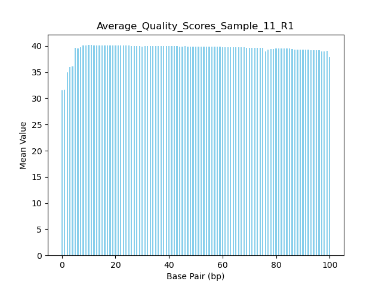

August 24th, 2024: Still Reeling from the Fact that I Exist 
---

Made a copy of Leslie's repo and put it in `/home/cwell/bgmp/bioinfo/Bi623/QAA`

`git clone https://github.com/claire-j-wells/QAA.git`

Made this beautiful lab notebook. 

Claire 11_2H_both_S9_L008      14_3B_control_S10_L008

Path files:

***11_2H_both_S9_L008*** <br>

11_R1: `/projects/bgmp/shared/2017_sequencing/demultiplexed/11_2H_both_S9_L008_R1_001.fastq.gz`

11_R2: `/projects/bgmp/shared/2017_sequencing/demultiplexed/11_2H_both_S9_L008_R2_001.fastq.gz`

***14_3B_control_S10_L008***<br>

C_R1: `/projects/bgmp/shared/2017_sequencing/demultiplexed/14_3B_control_S10_L008_R1_001.fastq.gz`

C_R2: `/projects/bgmp/shared/2017_sequencing/demultiplexed/14_3B_control_S10_L008_R2_001.fastq.gz`

Created conda environment:

`conda create --name QAA`

`conda install --name QAA fastqc=0.12.1`

Verified by:
`conda activate QAA`

`conda list`

`fastqc --version`

updated python to 3.12:
`conda install --name QAA python=3.12`

Data exploration stuff

For length of files: 

`zcat /projects/bgmp/shared/2017_sequencing/demultiplexed/14_3B_control_S10_L008_R2_001.fastq.gz | wc -l`

| File name | `wc -l` | Num. Records | Phred encoding | File Size | Read Length
|---|---|---|---|---|---|
| 11_2H_both_S9_L008_R1_001.fastq.gz | 71676772 | 17919193 | phred+33 | 917M | 101
| 11_2H_both_S9_L008_R2_001.fastq.gz | 71676772 | 17919193 | phred+33 | 987M | 101
| 14_3B_control_S10_L008_R2_001.fastq.gz | 17761512  | 4440378 | phred+33 | 231M | 101
| 14_3B_control_S10_L008_R2_001.fastq.gz | 17761512 | 4440378 | phred+33 | 260M | 101

Checked Phred Encoding by heading first 3 records, one from each set: 

`zcat /projects/bgmp/shared/2017_sequencing/demultiplexed/11_2H_both_S9_L008_R1_001.fastq.gz | head -n 12`

`zcat /projects/bgmp/shared/2017_sequencing/demultiplexed/14_3B_control_S10_L008_R2_001.fastq.gz | head -n 12`

Phred +33 encoding due to pound signs and slashes 

Check file size: `ls -lah /projects/bgmp/shared/2017_sequencing/demultiplexed/`

How I figured out read length: file name adjusted, output reported in table above:

`zcat /projects/bgmp/shared/2017_sequencing/demultiplexed/11_2H_both_S9_L008_R2_001.fastq.gz | sed -n '2~4p' | awk '{print length($0)}'
| head -4`


***SBATCH Job Numbers*** <br> 

15875292 11_R1 <br>
``
    Command being timed: "fastqc -o FastQC_11_out/R2_11 -t 1 /projects/bgmp/shared/2017_sequencing/demultiplexed/11_2H_both_S9_L008_R2_001.fastq.gz"
	User time (seconds): 69.36
	System time (seconds): 3.29
	Percent of CPU this job got: 99%
	Elapsed (wall clock) time (h:mm:ss or m:ss): 1:12.93

```

15875291 11_R2:
```
    Command being timed: "fastqc -o FastQC_11_out/R1_11 -t 1 /projects/bgmp/shared/2017_sequencing/demultiplexed/11_2H_both_S9_L008_R1_001.fastq.gz"
	User time (seconds): 65.27
	System time (seconds): 3.06
	Percent of CPU this job got: 98%
	Elapsed (wall clock) time (h:mm:ss or m:ss): 1:09.71
```
15875308 R1_C:

```
    Command being timed: "fastqc -o FastQC_C_out/R1_C -t 1 /projects/bgmp/shared/2017_sequencing/demultiplexed/14_3B_control_S10_L008_R1_001.fastq.gz"
	User time (seconds): 19.62
	System time (seconds): 0.92
	Percent of CPU this job got: 107%
	Elapsed (wall clock) time (h:mm:ss or m:ss): 0:19.17
```


15875309 R2_C:


```
    Command being timed: "fastqc -o FastQC_C_out/R2_C -t 1 /projects/bgmp/shared/2017_sequencing/demultiplexed/14_3B_control_S10_L008_R2_001.fastq.gz"
	User time (seconds): 19.82
	System time (seconds): 1.08
	Percent of CPU this job got: 109%
	Elapsed (wall clock) time (h:mm:ss or m:ss): 0:19.16
    


Sorted images into `Lab_Notebook_png/FastQC` folder. Four sub directories: `R1_11 and R2_11` and `R1_C and R2_C` respectively. Will add organized images to lab notebook later. 


Need N-content and per base quality


Install Trimmomatic and CutAdapt


`conda install --name QAA cutadapt=4.9`

`conda install --name QAA trimmomatic=0.39`

Versions Verified to be correct. 

Part 1 Question 2: When looking at the plots, they are consistent with the quality score plots because in the n-content plots we see a small spike in N and in the per base quality, we see a match that quality is lower. 

Made 2 slurm scripts: `avg_qual_11.sh` and `avg_qual_C.sh` for running my own script `avg_qual.py` from demultiplexing assignment. 

Edit: Something janky was going on. Made a slurm script for each individual file to avoid confusing myself. 

***Control***
| Average Qual Score Script | FastQC | 
|---|---|
| |  |
| |  |

***Sample 11***
| Average Qual Score Script | FastQC | 
|---|---|
| |  |
| |  |

Part 1, Question 3: The FastQC plots in general are the same as my own plots. FINISH THIS.


Cut Adapt Command General as per Manual: 

```
cutadapt \
    -a AGATCGGAAGAGCACACGTCTGAACTCCAGTCA \
    -A AGATCGGAAGAGCGTCGTGTAGGGAAAGAGTGT \
    -o trimmed.R1.fastq.gz -p trimmed.R2.fastq.gz \
    reads.R1.fastq.gz reads.R2.fastq.gz

```


Sanity Check for Adaptor Sequences
```
zcat /projects/bgmp/shared/2017_sequencing/demultiplexed/14_3B_control_S10_L008_R1_001.fastq.gz | grep -c "AGATCGGAAGAGCACACGTCTGAA
CTCCAGTCA" 

output: 27403
```

```
zcat /projects/bgmp/shared/2017_sequencing/demultiplexed/14_3B_control_S10_L008_R2_001.fastq.gz | grep -c "AGATCGGAAGAGCGTCGTGTAGGGAAAGAGTGT"

output: 27686
```

```
zcat /projects/bgmp/shared/2017_sequencing/demultiplexed/11_2H_both_S9_L008_R1_001.fastq.gz | grep -c "AGATCGGAAGAGCACACGTCTGAACTCCAGTCA"

output: 23629
```
```
zcat /projects/bgmp/shared/2017_sequencing/demultiplexed/11_2H_both_S9_L008_R2_001.fastq.gz | grep -c "AGATCGGAAGAGCGTCGTGTAGGGAAAGAGTGT"

output: 24496
```

Use this command to highlight the adaptor sequences in the file: 

Adjust files accordingly. 

```
zcat /projects/bgmp/shared/2017_sequencing/demultiplexed/11_2H_both_S9_L008_R2_001.fastq.gz | grep "AGATCGGAAGAGCGTCGTGTAGGGAAAGAGTGT"| less -p AGATCGGAAGAGCGTCGTGTAGGGAAAGAGTGT  
```


We used grep for to check for these sequences and we wanted to get a rough estimate for how many of the adaptor there was so we used -c. We confirmed the adaptor sequences by finding the Illumina command on the cutadapt manual and then confirmed this by checking on the assignment page. 

Sanity check: We would expect the adaptor sequences to be on the end because Illumina reads from 3' to 5'.


***cutadapt did NOT change the length of the file!!!***

August 25th, 2024: can't stop won't stop
-----

Doing some preliminary data analysis in order to figure out if trimmomatic is meant to be used on the original files or on the cutadapt outputs. 


```
zcat trimmed.R1_11.fastq.gz | sed -n '2~4p' | awk '{print length($0)}' | sort -nr | uniq -c 
```


Used the following command on `cutadapt` output files. Removed the `ILLUMINACLIP:TruSeq3-PE.fa:2:30:10` portion of the command because we do NOT want to remove adaptors since cutadapt already did that for us!!!! 

```
usr/bin/time -v trimmomatic PE /home/cwell/bgmp/bioinfo/Bi623/QAA/cut_adapt_out/trimmed.R1_11.fastq.gz /home/cwell/bgmp/bioinfo/Bi623/QAA/cut_adapt_out/trimmed.R2_11.fastq.gz output_forward_paired_R1_11.fq.gz output_forward_unpaired_R1_11.fq.gz output_reverse_paired_R2_11.fq.gz output_reverse_unpaired_R2_11.fq.gz LEADING:3 TRAILING:3 SLIDINGWINDOW:5:15 MINLEN:35
````

```
/usr/bin/time -v trimmomatic PE /home/cwell/bgmp/bioinfo/Bi623/QAA/cut_adapt_out/trimmed.R1_Control.fastq.gz /home/cwell/bgmp/bioinfo/Bi623/QAA/cut_adapt_out/trimmed.R2_Control.fastq.gz output_forward_paired_R1_Control.fq.gz output_forward_unpaired_R1_Control.fq.gz output_reverse_paired_R2_Control.fq.gz output_reverse_unpaired_R2_Control.fq.gz LEADING:3 TRAILING:3 SLIDINGWINDOW:5:15 MINLEN:35
```

Time output for Trimmomatic Run on Control. Exit Status 0. 

```
User time (seconds): 244.15
        System time (seconds): 4.32
        Percent of CPU this job got: 212%
        Elapsed (wall clock) time (h:mm:ss or m:ss): 1:56.93
```


